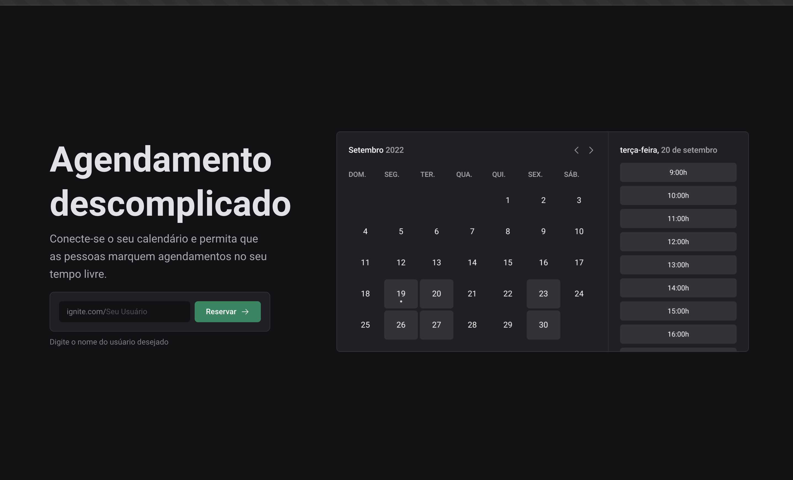
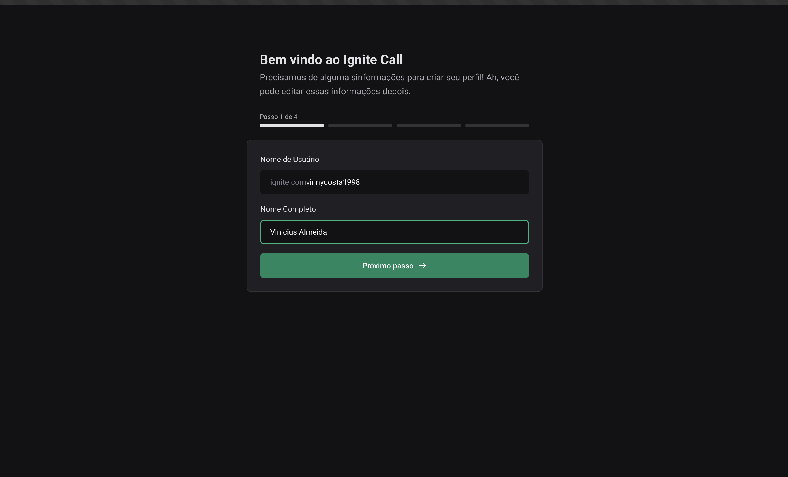
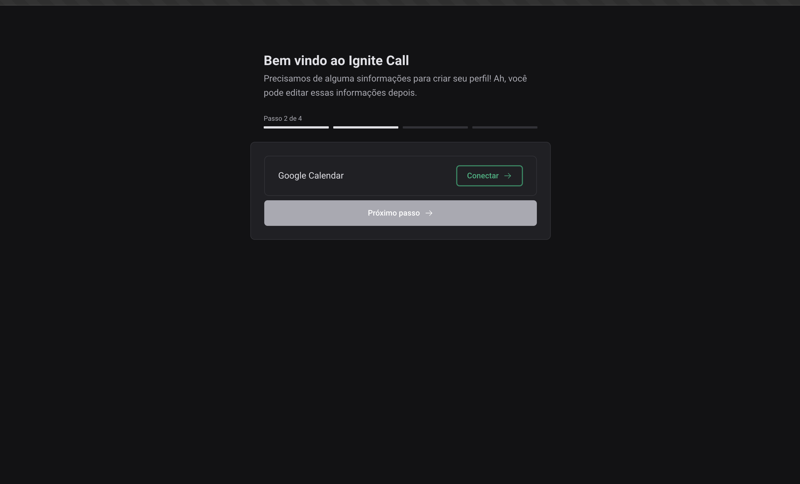
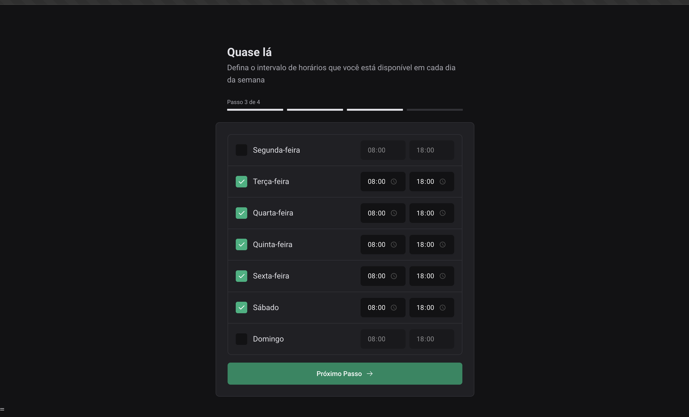
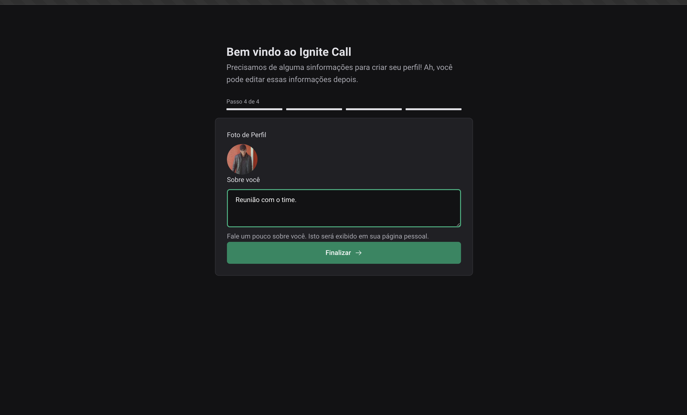

# 📸 Overview:







# 💻 Project:
Aplicação Frontend capaz de conectar com a o Google Calendar e agendar um horário na sua agenda.

Frontend application capable of connecting with Google Calendar and scheduling a time on your calendar.

# 🚀 Technologies:
### ✔️ Axios
### ✔️ NextJS 
### ✔️ Next Auth
### ✔️ React Hook Form
### ✔️ StitchesJS
### ✔️ TypeScript
### ✔️ Zod

# How to run

```
# Clone this repository
$ git clone https://github.com/vinnycosta9898/ignite-call

# Run the container
$ docker compose up -d

# Go to the directory
$ cd ignite-call

# Install Dependencies
$ npm install

# Run Web Server
$ npm run dev